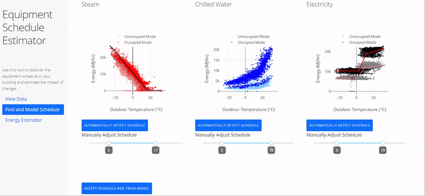
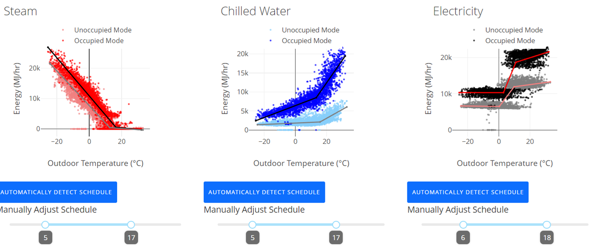
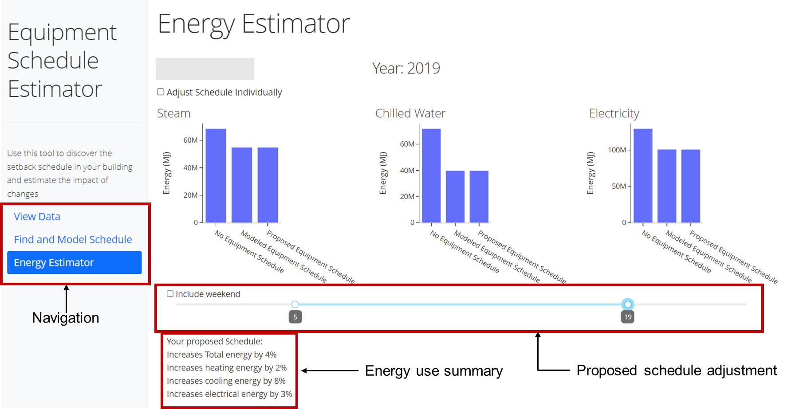

# Schedule Energy Prototype
 
##### Data-driven evaluations of building operational settings

Abstract:
*Building automation systems have created opportunities for energy saving in commercial buildings; however, these systems are typically not well designed for data analysis. To respond to this, tools for continuously monitoring and analyzing building data are becoming increasingly popular. This work proposes a data-driven method to estimate the energy associated with equipment schedules; packaged into an interactive tool. We discuss this tool’s role in a building operator’s workflow, focusing on prioritizing short interaction time, metric transparency, and robust outputs. When applied to a case study office building, we found that even minor adjustments to equipment schedules provide a non-trivial effect on energy. For example, extending the weekday occupied mode operation from 5 pm to 8 pm would lead to an estimated 5% increase in annual energy use compared to current practices. This tool could be rapidly applied to building portfolios to understand how widespread changes to operation affect energy use.*

Link to open access conference paper [here](https://publications.ibpsa.org/conference/paper/?id=esim2022_240).

## Demonstration

This tool, written in Python using [Plotly's dash](https://dash.plotly.com/), allows interactive modeling of current building HVAC schedules and simulating changes. It applies change point analysis to infer and model existing schedules based on hourly energy data.

## Available Interfaces

#### View Data:
This is not a core capability of the tool but instead supports users in understanding their input data. By clicking on the view data item on the left side navigation menu, users can view hourly time series data for all years in which building data is available. This feature could be useful for users interested in visually inspecting the prevalence of equipment schedules and outliers in data.
#### Find schedule:
By going to the find and model schedule button on the navigation bar. Users can select the building and year for modeling. Typically, it would be best to use the most recent year; however, the user may be interested in a previous year instead. One example would be if the user was interested in operation before changes were made due to COVID-19. After the year is selected, the user can use the automatically detect schedules button to separate the data. The determined equipment schedule will display for the user, and the user can manually fine-tune the schedule based on their knowledge of the building. If the user notices something that looks unusual, they can return to the view data page to access the raw time-series data. An example of this interface is shown in Figure 6.

#### Train Model:
Once the user is satisfied that the schedule they defined is a good representation of operations, the accept schedule and train model button can be used to train the linear piecewise model. Once trained, the model will appear on the graph for the user to inspect.

#### Estimate energy:
The user then can navigate to the estimate energy tab where they will be presented with three bar charts, one for each utility uses. The user can adjust the proposed building schedule slider to the proposed schedule and view the impacts of this change. A summary is presented to the user below of the effect of this change. An example of this interface is shown in Figure 4.

